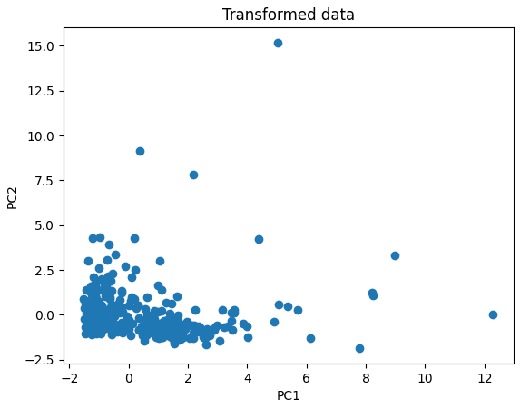
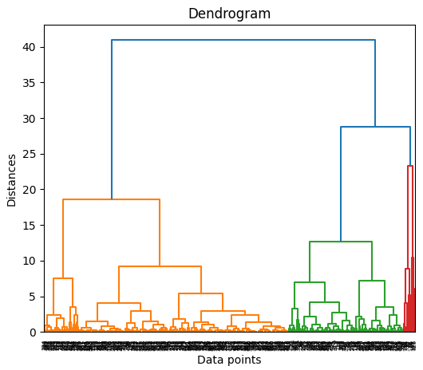
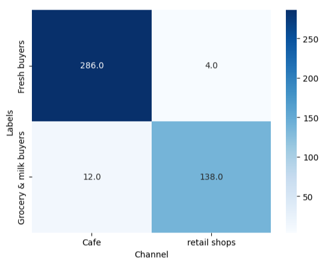
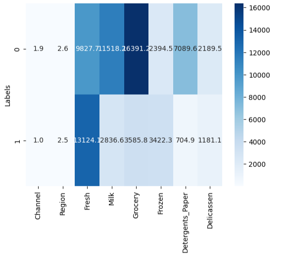

# Hierarchical Clustering with PCA

## 📌 Project Overview  
This project applies **Hierarchical Clustering** with **PCA (Principal Component Analysis)** on the **Wholesale Customers Dataset**. The goal is to group customers into clusters based on purchasing behavior and compare them against the provided channel information.  

- Dataset: *Wholesale customers data.csv*  
- Method: **Agglomerative Clustering** (Ward linkage, Euclidean distance)  
- Dimensionality reduction: **PCA (2 components)**  

---

## ⚙️ Steps Performed  

1. **Libraries Imported**  
   - `pandas`, `numpy` for data handling  
   - `sklearn.preprocessing.StandardScaler` for scaling  
   - `sklearn.decomposition.PCA` for dimensionality reduction  
   - `scipy.cluster.hierarchy` for dendrogram  
   - `sklearn.cluster.AgglomerativeClustering` for clustering  
   - `matplotlib` & `seaborn` for visualization  

2. **Data Preprocessing**  
   - Dataset loaded from `Wholesale customers data.csv`  
   - Features standardized using **StandardScaler**  
   - Dimensionality reduced to 2 components using **PCA**  

3. **Visualization**  
   - Scatter plot of PCA-transformed data  
   - Dendrogram to decide number of clusters  

4. **Model Training**  
   - Agglomerative Clustering applied with **2 clusters**  
   - Labels assigned to each data point  

5. **Cluster Analysis**  
   - Cluster means analyzed via **heatmap**  
   - Clusters labeled as:  
     - **Cluster 0 → Retail Shops**  
     - **Cluster 1 → Cafe**  

6. **Comparison with Actual Channels**  
   - Original dataset channels mapped as:  
     - **1 → Cafe**  
     - **2 → Retail Shops**  
   - Cross-tabulation and heatmap created to evaluate clustering performance  

---

## 📊 Results  

- **Cluster 0 (Retail Shops):** Higher spending on **Grocery & Milk**  
- **Cluster 1 (Cafe):** Higher spending on **Fresh products**  
- Dendrogram supported **2 natural clusters**  
- Heatmap shows **close alignment** between predicted clusters and actual channel labels  

---

## 📷 Visuals  

  
  
  
  

---

## 📁 Files  

- `Wholesale customers data.csv` – Dataset  
- `wholesale customer clustering.ipynb` – Jupyter Notebook with full code  

---

## 👨‍💻 Author  
Developed by [SaifUllah Umar](https://github.com/SaifUllahUmar0317/)
